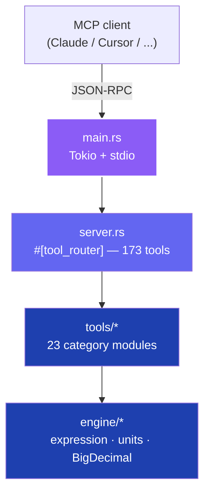

<div align="center">

# arithma

### The Ultimate LLM Calculator Engine

[](https://www.rust-lang.org)
[](./LICENSE)
[](https://modelcontextprotocol.io)
[](./scripts/test_stdio.py)
[](#build-profiles)
[](./docs/TOOLS.md)

A pure-Rust [**Model Context Protocol**](https://modelcontextprotocol.io) server that exposes **173 expert-grade calculator tools** to any LLM. Arbitrary-precision math, correctly-rounded transcendentals, finance, calculus, statistics, combinatorics, geometry, complex numbers, matrices, physics, chemistry, crypto/encoding, networking, electronics, unit conversion, and date/time — all behind a single static stdio binary.

[Quick start](#quick-start) · [Integration](#integration) · [Tool catalog](#tool-catalog) · [Examples](#examples) · [Architecture](#architecture) · [Docs](#documentation)

</div>

---

## Table of contents

- [Why arithma](#why-arithma)
- [Quick start](#quick-start)
  - [Build profiles](#build-profiles)
- [Integration](#integration)
- [Tool catalog](#tool-catalog)
- [Examples](#examples)
- [Architecture](#architecture)
- [Precision guarantees](#precision-guarantees)
- [Development](#development)
  - [Project layout](#project-layout)
- [Documentation](#documentation)
- [Contributing](#contributing)
- [License](#license)

---

## Why arithma


- **Precision first** — `BigDecimal` with DECIMAL128 semantics (34 digits, HALF_UP), 128-bit transcendentals via `astro-float`.
- **Zero C deps** — pure Rust, single static binary for Linux, macOS, and Windows.
- **Portable SIMD** — runtime dispatch across SSE2 / AVX2 / AVX-512 / NEON via `wide`.
- **IANA timezones** — embedded via `jiff`, no `libicu`.
- **Tested** — 690 unit tests + 234 stdio integration tests across 23 categories, full suite in under a second.
- **Stateless** — every call is independent; safe to fan out concurrently.

> [!NOTE]
> arithma is built specifically for LLM tool-use. Every response is a compact, line-oriented string — `TOOL: OK | KEY: value | …` on success, `TOOL: ERROR\nREASON: [CODE] …` on failure — so it round-trips safely through the MCP boundary and is trivial for an LLM to parse.

---

## Quick start

```bash
git clone https://github.com/farchanjo/arithma.git
cd arithma
cargo build --release
./target/release/arithma   # binary: ~3 MB
```

> [!IMPORTANT]
> Rust **1.94+** is required (pinned in [`rust-toolchain.toml`](./rust-toolchain.toml)).

### Build profiles

| Profile | Command | Use case |
|:---|:---|:---|
| **Native** | `cargo build --release` | Fastest on this machine (`target-cpu=native`). |
| **Portable** | `RUSTFLAGS="-C target-cpu=x86-64-v3" cargo build --profile release-portable` | Haswell+/AVX2, redistributable. |
| **Dev** | `cargo build` | Debug symbols, incremental compilation. |

---

## Integration

<details open>
<summary><b>Claude Code</b></summary>

```bash
claude mcp add arithma -- /absolute/path/to/target/release/arithma
```

</details>

<details>
<summary><b>Claude Desktop / generic MCP clients</b></summary>

Add the following to your client's MCP config (`mcp.json` or equivalent):

```json
{
  "mcpServers": {
    "arithma": {
      "command": "/absolute/path/to/target/release/arithma"
    }
  }
}
```

</details>

<details>
<summary><b>Cursor, Windsurf, OpenCode</b></summary>

All of these speak the same stdio MCP protocol. Point their config at the `arithma` binary path — no extra flags required.

</details>

<details>
<summary><b>Verify the server responds</b></summary>

```bash
(printf '{"jsonrpc":"2.0","id":1,"method":"initialize","params":{"protocolVersion":"2024-11-05","capabilities":{},"clientInfo":{"name":"test","version":"1"}}}\n';
 printf '{"jsonrpc":"2.0","method":"notifications/initialized"}\n';
 printf '{"jsonrpc":"2.0","id":2,"method":"tools/list","params":{}}\n';
 sleep 0.3) | ./target/release/arithma 2>/dev/null | head -c 500
```

The response must contain `tools/list` with all 173 tools.

</details>

---

## Tool catalog

**173 tools · 23 categories.** Full reference with inputs, outputs, and examples lives in [`docs/TOOLS.md`](./docs/TOOLS.md).

| # | Category | Tools | Highlights |
|:-:|:---|:-:|:---|
| 1 | Basic math | 7 | `add`, `subtract`, `multiply`, `divide`, `power`, `modulo`, `abs` |
| 2 | Scientific | 7 | `sqrt`, `log`, `log10`, `factorial`, `sin`, `cos`, `tan` |
| 3 | Expression engine | 4 | `evaluate`, `evaluateExact` + variable variants — `pi`, `e`, `tau`, `phi` constants and 30+ functions (trig, hyperbolic, exp, log, `gcd`, `hypot`, `factorial`, …) |
| 4 | Vectors & arrays | 4 | `sumArray`, `dotProduct`, `scaleArray`, `magnitudeArray` |
| 5 | Finance | 6 | `compoundInterest`, `loanPayment`, `presentValue`, `futureValueAnnuity`, `returnOnInvestment`, `amortizationSchedule` |
| 6 | Calculus | 4 | `derivative`, `nthDerivative`, `definiteIntegral`, `tangentLine` |
| 7 | Unit conversion | 2 | `convert`, `convertAutoDetect` (21 categories, 118 units) |
| 8 | Cooking | 3 | Volume, weight, oven temperature (incl. gas mark) |
| 9 | Measure reference | 4 | `listCategories`, `listUnits`, `getConversionFactor`, `explainConversion` |
| 10 | Date & time | 5 | Timezone conversion, formatting, differences, IANA listing |
| 11 | Tape calculator | 1 | `calculateWithTape` with running totals |
| 12 | Graphing & roots | 3 | `plotFunction`, `solveEquation`, `findRoots` |
| 13 | Networking | 13 | Subnetting, VLSM, IPv4/IPv6, throughput, TCP window |
| 14 | Analog electronics | 14 | Ohm's law, filters, impedance, resonance, 555 timers |
| 15 | Digital electronics | 10 | Bases, two's complement, Gray code, ADC/DAC, Nyquist |
| 16 | Statistics | 16 | `mean`, `median`, `mode`, `stdDev`, `percentile`, `correlation`, `linearRegression`, `normalPdf/Cdf`, `tTestOneSample`, `binomialPmf`, `confidenceInterval` |
| 17 | Combinatorics & number theory | 7 | `combination`, `permutation`, `fibonacci`, `isPrime`, `nextPrime`, `primeFactors`, `eulerTotient` (exact arbitrary precision) |
| 18 | Geometry | 12 | Circle/sphere/cone/cylinder, Heron triangle, Shoelace polygon, regular polygon, 2D/3D distances |
| 19 | Complex numbers | 10 | Add/mult/div/power/sqrt, magnitude, phase, polar⇄rect (degrees) |
| 20 | Crypto & encoding | 10 | MD5, SHA-1/256/512, Base64, URL, hex, CRC-32 |
| 21 | Matrices | 10 | Add, multiply, transpose, determinant, inverse, trace, rank, 2x2 eigenvalues, cross product, Gaussian elimination |
| 22 | Physics | 12 | Kinematics, projectile motion, Newton's law, gravity, Doppler, wavelength, Planck, ideal gas, heat transfer, Stefan-Boltzmann, escape & orbital velocity |
| 23 | Chemistry | 9 | Molar mass (nested formulas), pH/pOH, molarity, molality, Henderson-Hasselbalch, half-life, decay constant, ideal-gas moles |

---

## Examples

All tools use the standard MCP `tools/call` JSON-RPC method. Every response is a single string in the arithma wire format.

> [!TIP]
> Pass numeric values as **strings** (e.g. `"0.1"`, not `0.1`) to preserve arbitrary precision across the JSON boundary.

### Response format at a glance

| Shape | Layout |
|:---|:---|
| Scalar success | `TOOL: OK \| RESULT: value` |
| Multi-field success | `TOOL: OK \| KEY_1: v1 \| KEY_2: v2 \| …` |
| Tabular success (block) | `TOOL: OK\n<fields>\nROW_1: k=v \| k=v\nROW_2: …` |
| Error | `TOOL: ERROR\nREASON: [CODE] text\n[DETAIL: k=v]` |

Tool names are rendered in `SCREAMING_SNAKE_CASE`. Error codes: `DOMAIN_ERROR`, `OUT_OF_RANGE`, `DIVISION_BY_ZERO`, `PARSE_ERROR`, `INVALID_INPUT`, `UNKNOWN_VARIABLE`, `UNKNOWN_FUNCTION`, `OVERFLOW`, `NOT_IMPLEMENTED`.

### Real round-trips

```text
→ add             {"first":"0.1","second":"0.2"}
← ADD: OK | RESULT: 0.3

→ divide          {"first":"10","second":"3"}
← DIVIDE: OK | RESULT: 3.33333333333333333333

→ sin             {"degrees":30}
← SIN: OK | RESULT: 0.5

→ evaluateWithVariables
  {"expression":"2*x + y","variables":"{\"x\":3,\"y\":1}"}
← EVALUATE_WITH_VARIABLES: OK | RESULT: 7.0

→ convert         {"value":"1","fromUnit":"km","toUnit":"mi","category":"LENGTH"}
← CONVERT: OK | RESULT: 0.6213711922373339696174341843633182

→ compoundInterest
  {"principal":"1000","annualRate":"5","years":"10","compoundsPerYear":12}
← COMPOUND_INTEREST: OK | RESULT: 1647.009497690283034841743827660086

→ subnetCalculator {"address":"192.168.1.0","cidr":24}
← SUBNET_CALCULATOR: OK | NETWORK: 192.168.1.0 | BROADCAST: 192.168.1.255
  | MASK: 255.255.255.0 | WILDCARD: 0.0.0.255 | FIRST_HOST: 192.168.1.1
  | LAST_HOST: 192.168.1.254 | USABLE_HOSTS: 254 | IP_CLASS: C
```

### Error example

```text
→ divide {"first":"1","second":"0"}
← DIVIDE: ERROR
  REASON: [DIVISION_BY_ZERO] cannot divide by zero
```

Full wire-level walkthrough: [`docs/API.md`](./docs/API.md).

---

## Architecture



| Crate | Role |
|:---|:---|
| [`rmcp`](https://crates.io/crates/rmcp) | Official Rust MCP SDK (protocol + schema). |
| [`tokio`](https://crates.io/crates/tokio) | Multi-threaded async runtime for stdio I/O. |
| [`bigdecimal`](https://crates.io/crates/bigdecimal) + [`num-bigint`](https://crates.io/crates/num-bigint) | Arbitrary-precision arithmetic (DECIMAL128). |
| [`astro-float`](https://crates.io/crates/astro-float) | 128-bit, correctly-rounded transcendentals. |
| [`jiff`](https://crates.io/crates/jiff) | IANA timezones, embedded database. |
| [`wide`](https://crates.io/crates/wide) | Portable SIMD dispatch. |
| [`tracing`](https://crates.io/crates/tracing) | Structured logging to stderr (stdout stays clean). |

Deep dive: [`docs/ARCHITECTURE.md`](./docs/ARCHITECTURE.md).

---

## Precision guarantees

| Domain | Precision | Method |
|:---|:---|:---|
| Basic arithmetic | Exact | `BigDecimal` |
| Division | 20 decimal places | HALF_UP per DECIMAL128 |
| `sin` / `cos` / `tan` | Exact at 0/30/45/60/90° | Lookup + `astro-float` fallback |
| `factorial` | Exact for `n ∈ [0, 20]` | `u64` table |
| `evaluate` | ~15–17 digits | `f64` fast path |
| `evaluateExact` | ~34 digits | 128-bit `astro-float` |
| Unit conversion | 34 digits | DECIMAL128 factors |
| Financial | 34 digits | DECIMAL128 context |
| Date / Time | IANA standard | Embedded tz database |

> [!WARNING]
> The fast `evaluate` path uses `f64` for speed and is subject to standard IEEE-754 rounding. Use `evaluateExact` when you need 128-bit precision.

---

## Development

```bash
cargo fmt --check
cargo clippy --all-targets --all-features -- -D warnings
cargo test --lib                 # 690 unit tests
python3 scripts/test_stdio.py    # 234 stdio integration tests
```

All four must pass before committing. See [`docs/DEVELOPMENT.md`](./docs/DEVELOPMENT.md) for layout, conventions, and the contribution workflow.

### Project layout

```
arithma/
├── Cargo.toml                   Dependencies, lint + release profiles
├── rust-toolchain.toml          Rust 1.94+ pin
├── src/
│   ├── main.rs                  Binary entry, stdio MCP transport
│   ├── lib.rs                   Library exports
│   ├── server.rs                #[tool_router] — all 173 tools
│   ├── engine/                  Expression parser, unit registry, BigDecimal helpers
│   ├── mcp/                     MCP message helpers
│   └── tools/                   23 category modules
├── scripts/test_stdio.py        Full stdio integration test
└── docs/                        INDEX · ARCHITECTURE · TOOLS · DEVELOPMENT · API
```

---

## Documentation

| Doc | Purpose |
|:---|:---|
| [`docs/INDEX.md`](./docs/INDEX.md) | Navigation starting point. |
| [`docs/ARCHITECTURE.md`](./docs/ARCHITECTURE.md) | Module layout, data flow, design decisions. |
| [`docs/TOOLS.md`](./docs/TOOLS.md) | Every tool: inputs, outputs, examples. |
| [`docs/DEVELOPMENT.md`](./docs/DEVELOPMENT.md) | Build, test, lint, contribute. |
| [`docs/API.md`](./docs/API.md) | MCP integration and calling conventions. |

---

## Contributing

Issues and PRs welcome. Keep the workflow green:

- [x] `cargo fmt` — formatted.
- [x] `cargo clippy --all-targets -- -D warnings` — zero warnings.
- [x] `cargo test --lib` — all unit tests pass.
- [x] `python3 scripts/test_stdio.py` — all 234 stdio tests pass.
- [x] en-US only in code, commits, and docs.

Use the [Angular commit format](https://github.com/angular/angular/blob/main/CONTRIBUTING.md#commit): `<type>(<scope>): <subject>`.

---

## License

Licensed under the [Apache License, Version 2.0](./LICENSE).

---

<div align="center">

**Built by** [@farchanjo](https://github.com/farchanjo) · [fabricio@archanjo.com](mailto:fabricio@archanjo.com)

</div>
