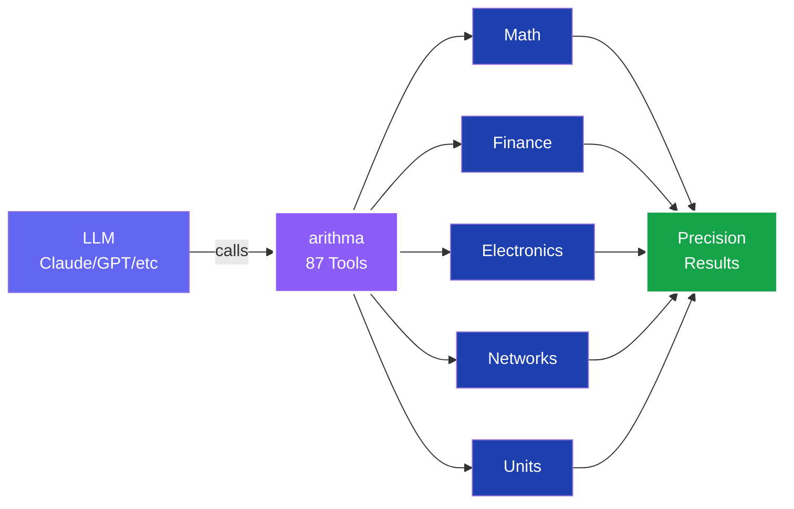
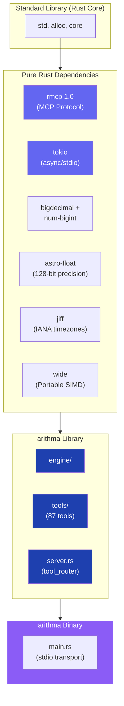

<div align="center">

# arithma

**The Ultimate LLM Calculator Engine**

[](https://www.rust-lang.org)
[](LICENSE)
[](https://modelcontextprotocol.io)
[](scripts/test_stdio.py)

**Precision mathematics at scale.** A pure-Rust [Model Context Protocol](https://modelcontextprotocol.io) server exposing **87 expert-grade calculator tools** designed for LLMs. Arbitrary-precision arithmetic, exact transcendentals, networking, electronics, finance, and unit conversion — all over a single stdio binary.

</div>

## Why arithma?



## Core Strengths

- **Pure Rust, zero C dependencies** — single `~3 MB` static binary for Linux, macOS, Windows
- **Arbitrary-precision arithmetic** via [`bigdecimal`](https://crates.io/crates/bigdecimal) + [`num-bigint`](https://crates.io/crates/num-bigint) — DECIMAL128 precision, HALF_UP rounding
- **Correctly-rounded transcendentals** via [`astro-float`](https://crates.io/crates/astro-float) — 128-bit precision for trig, log, and advanced math
- **IANA timezone support** via [`jiff`](https://crates.io/crates/jiff) — no `libicu`, zero C deps
- **Portable SIMD** via [`wide`](https://crates.io/crates/wide) — auto-dispatches SSE2/AVX2/AVX-512/NEON
- **CPU optimization** — `target-cpu=native` for max speed, `release-portable` for distribution
- **Bulletproof testing** — 434 unit + integration tests, sub-second full suite

## Table of contents

- [Install](#install)
- [Build from source](#build-from-source)
- [Wire into an MCP client](#wire-into-an-mcp-client)
- [Tool matrix (85 tools)](#tool-matrix-85-tools)
- [Examples](#examples)
- [Architecture](#architecture)
- [Precision Guarantees](#precision-guarantees)
- [Development](#development)
- [License](#license)

## Quick Start

### Install

```bash
git clone https://github.com/farchanjo/arithma.git
cd arithma
cargo build --release
# Binary: ./target/release/arithma
```

**Requirements**: Rust 1.94+ (pinned in `rust-toolchain.toml`)

### Build Profiles

```bash
# Native CPU (fastest, uses target-cpu=native via .cargo/config.toml)
cargo build --release

# Portable build (targets x86-64-v3, Haswell+, includes AVX2)
RUSTFLAGS="-C target-cpu=x86-64-v3" cargo build --profile release-portable

# Run the server directly
./target/release/arithma

# Or via cargo
cargo run --release --bin arithma
```

## Integration

### Claude Code

```bash
claude mcp add arithma -- /absolute/path/to/target/release/arithma
```

### Claude Desktop / Generic MCP Client

```json
{
  "mcpServers": {
    "arithma": {
      "command": "/absolute/path/to/target/release/arithma"
    }
  }
}
```

### Cursor, Windsurf, OpenCode, etc.

Same stdio interface. Point to the binary path.

### Verify Integration

```bash
(printf '{"jsonrpc":"2.0","id":1,"method":"initialize","params":{"protocolVersion":"2024-11-05","capabilities":{},"clientInfo":{"name":"test","version":"1"}}}\n';
 printf '{"jsonrpc":"2.0","method":"notifications/initialized"}\n';
 printf '{"jsonrpc":"2.0","id":2,"method":"tools/list","params":{}}\n';
 sleep 0.3) | ./target/release/arithma 2>/dev/null | head -c 500
```

Should return `initialize` response + `tools/list` containing all 87 tools.

## Tool Catalog — 87 Expert Tools

| Category | Count | Examples |
|:---|:---:|:---|
| **Basic Math** | 7 | `add`, `subtract`, `multiply`, `divide`, `power`, `modulo`, `abs` |
| **Scientific** | 7 | `sqrt`, `log`, `log10`, `factorial`, `sin`, `cos`, `tan` |
| **Expression Engine** | 4 | `evaluate`, `evaluateWithVariables`, `evaluateExact`, `evaluateExactWithVariables` |
| **Vectors & Arrays** | 4 | `sumArray`, `dotProduct`, `scaleArray`, `magnitudeArray` |
| **Finance & Compound Interest** | 6 | `compoundInterest`, `loanPayment`, `presentValue`, `futureValueAnnuity`, `returnOnInvestment`, `amortizationSchedule` |
| **Calculus** | 4 | `derivative`, `nthDerivative`, `definiteIntegral`, `tangentLine` |
| **Unit Conversion** | 2 | `convert`, `convertAutoDetect` (21 categories, 118 units) |
| **Cooking Conversions** | 3 | `convertCookingVolume`, `convertCookingWeight`, `convertOvenTemperature` |
| **Measurement Reference** | 4 | `listCategories`, `listUnits`, `getConversionFactor`, `explainConversion` |
| **Date & Time** | 5 | `convertTimezone`, `formatDateTime`, `currentDateTime`, `listTimezones`, `dateTimeDifference` |
| **Tape Calculator** | 1 | `calculateWithTape` |
| **Graphing & Roots** | 3 | `plotFunction`, `solveEquation`, `findRoots` |
| **Networking** | 13 | `subnetCalculator`, IPv4/IPv6, CIDR, VLSM, throughput calculations |
| **Analog Electronics** | 14 | `ohmsLaw`, resistor/capacitor/inductor combinations, filters, impedance, decibels |
| **Digital Electronics** | 10 | `convertBase`, `twosComplement`, `grayCode`, bitwise ops, ADC/DAC, timers |

## Examples

All tool calls use the standard MCP `tools/call` JSON-RPC method. Examples of the `arguments` payload and the returned text:

### Arbitrary-precision arithmetic (no f64 drift)

```json
{"name": "add",    "arguments": {"first": "0.1", "second": "0.2"}}           // "0.3"
{"name": "divide", "arguments": {"first": "10", "second": "3"}}              // "3.33333333333333333333"
```

### Exact trig at notable angles

```json
{"name": "sin", "arguments": {"degrees": 30}}                                // "0.5"
{"name": "cos", "arguments": {"degrees": 60}}                                // "0.5"
{"name": "tan", "arguments": {"degrees": 45}}                                // "1.0"
```

### Expression evaluation with variables

```json
{"name": "evaluate",              "arguments": {"expression": "2+3*4"}}                       // "14.0"
{"name": "evaluateWithVariables", "arguments": {"expression": "2*x+y", "variables": "{\"x\":3,\"y\":1}"}} // "7.0"
```

### High-precision unit conversion

```json
{"name": "convert", "arguments": {"value": "1", "fromUnit": "km", "toUnit": "mi", "category": "LENGTH"}}
// "0.6213711922373339696174341843633182"
```

### Financial

```json
{"name": "compoundInterest", "arguments": {"principal": "1000", "annualRate": "5", "years": "10", "compoundsPerYear": 12}}
// "1647.009497690283034841743827660086"
```

### Networking

```json
{"name": "subnetCalculator", "arguments": {"address": "192.168.1.0", "cidr": 24}}
// {"network":"192.168.1.0","broadcast":"192.168.1.255","mask":"255.255.255.0",
//  "wildcard":"0.0.0.255","firstHost":"192.168.1.1","lastHost":"192.168.1.254",
//  "usableHosts":254,"ipClass":"C"}
```

### Calculus

```json
{"name": "definiteIntegral", "arguments": {"expression": "x^2", "variable": "x", "lower": 0, "upper": 1}}
// "0.3333333333500001"
```

## Architecture



**One static binary**, zero C dependencies, cross-platform.

**Production Dependencies** (all pure Rust, zero C FFI):

| Crate | Purpose |
|:---|:---|
| `rmcp` (1.0) | Official Rust MCP SDK — protocol + serialization |
| `tokio` | Async runtime with multi-threaded executor for stdio I/O |
| `bigdecimal` + `num-bigint` | Arbitrary-precision arithmetic with DECIMAL128 semantics |
| `astro-float` | 128-bit float with correctly-rounded transcendentals |
| `jiff` | Timezone-aware datetime with embedded IANA data (no `libicu`) |
| `wide` | Portable SIMD with runtime dispatch (SSE2/AVX2/AVX-512/NEON) |
| `serde` + `serde_json` | JSON serialization for MCP protocol |
| `schemars` | JSON Schema generation for tool parameters |
| `tracing` + `tracing-subscriber` | Structured logging to stderr (keeps stdout/stdio clean) |

## Precision Guarantees

arithma delivers **production-grade precision** across all 87 tools with consistent, predictable behavior.

| Domain | Precision | Method |
|:---|:---|:---|
| **Basic Math** | Exact | `BigDecimal` (arbitrary precision) |
| **Division** | 20 decimal places | HALF_UP rounding per DECIMAL128 |
| **Scientific (sin, cos, tan, log)** | Exact at notable angles | Lookup tables; astro-float elsewhere |
| **Factorial** | 0–20 range | Exact `u64` values |
| **Unit Conversion** | 34 significant digits | DECIMAL128 precision factors |
| **Financial** | DECIMAL128 context | Compound interest, amortization, IRR |
| **Electronics** | 128-bit float | Impedance, Q-factor, decibels |
| **Date/Time** | IANA standard | Embedded timezone database, leap seconds |

**Error Messages**: Clear, actionable error text for debugging and user feedback.

## Development & Testing

```bash
# Format check
cargo fmt --check

# Lint (all targets, warnings as errors)
cargo clippy --all-targets --all-features -- -D warnings

# Run unit tests
cargo test --lib

# Full integration test (87 tools via stdio)
python3 scripts/test_stdio.py

# Release build
cargo build --release
```

All tests pass in under 1 second. CI enforces format, lint, and test pass before merge.

### Project Layout

```
arithma/
├── .cargo/config.toml              ← Cargo settings, target-cpu=native
├── clippy.toml                     ← Linter configuration
├── rust-toolchain.toml             ← Rust 1.94+ requirement
├── Cargo.toml                      ← Dependencies, build profiles
├── src/
│   ├── main.rs                     ← Binary entry (stdio MCP server)
│   ├── lib.rs                      ← Library exports
│   ├── server.rs                   ← #[tool_router] — all 87 tools
│   ├── engine/                     ← Expression parser, unit registry
│   └── tools/                      ← 15 modules, one per tool category
├── scripts/
│   └── test_stdio.py               ← Integration test (87 tools in ~0.5s)
├── arithma-logo.svg                ← Branding
└── target/release/arithma          ← Final binary (~3 MB)
```

---

## License

Licensed under the [Apache License, Version 2.0](LICENSE).

---

## Contributing

Issues and PRs welcome. Maintain:
- ✅ Code formatting (`cargo fmt`)
- ✅ Zero clippy warnings (`cargo clippy -- -D warnings`)
- ✅ All tests passing (`cargo test`)
- ✅ Numerical accuracy across all 87 tools

---

**Built by** [@farchanjo](https://github.com/farchanjo) | **Contact**: [fabricio@archanjo.com](mailto:fabricio@archanjo.com)
