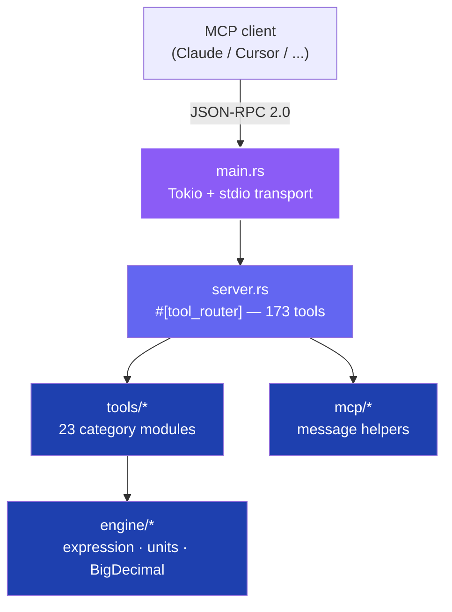

# Architecture

arithma is a **stateless stdio MCP server**. Each tool call is a self-contained computation that flows from the transport layer, through the tool router, into the math engine, and back as a plain string.

## System overview



## Layers

### 1. Transport — `src/main.rs`

- Boots a multi-threaded Tokio runtime.
- Reads JSON-RPC 2.0 messages from `stdin`, writes responses to `stdout`.
- Sends all logs to `stderr` (keeps the stdio channel clean).

### 2. MCP server — `src/server.rs`

- One `#[tool_router]` block registers **all 173 tools**.
- Handles parameter deserialization (JSON → Rust types) and schema generation.
- Tool functions return a pre-formatted envelope string; nothing else needs to know the wire format.

### 3. Tool modules — `src/tools/*`

Twenty-three category modules, one file each:

```
basic · scientific · programmable · vector · financial · calculus
unit_converter · cooking · measure_reference · datetime · printing
graphing · network · analog_electronics · digital_electronics
statistics · combinatorics · geometry · complex · crypto
matrices · physics · chemistry
```

Every tool has the signature `pub fn name(...) -> String` and constructs its response through the shared builder in `src/mcp/message/builder.rs`. Successes become `TOOL: OK | KEY: value | …` (inline) or a block layout for tabular payloads (`ROW_N: k=v | …`). Errors become `TOOL: ERROR\nREASON: [CODE] text\n[DETAIL: k=v]` — the code set is fixed (`DOMAIN_ERROR`, `OUT_OF_RANGE`, `DIVISION_BY_ZERO`, `PARSE_ERROR`, `INVALID_INPUT`, `UNKNOWN_VARIABLE`, `UNKNOWN_FUNCTION`, `OVERFLOW`, `NOT_IMPLEMENTED`).

### 4. Math engine — `src/engine/*`

| File | Responsibility |
|:---|:---|
| `expression.rs` | Recursive-descent parser + `f64` evaluator. Operators `+ - * / ^ %`; constants `pi`, `e`, `tau`, `phi`; trig/inverse-trig/hyperbolic, exp/ln/log10/log2, sqrt/cbrt, round/trunc/sign, factorial, min/max/mod/hypot/pow/gcd/lcm. |
| `expression_exact.rs` | Same grammar and surface, 128-bit evaluator via `astro-float` (feeds `evaluateExact*`). |
| `unit_registry.rs` | 21 categories × 118 units. Factors stored as `BigDecimal`. Temperature routes through a Celsius pivot; gas mark uses a fixed table. |
| `bigdecimal_ext.rs` | DECIMAL128 context (34 digits, HALF_UP), scale helpers, plain-string formatting (no scientific notation). |

### 5. MCP message layer — `src/mcp/*`

Single source of truth for the wire format:

| File | Responsibility |
|:---|:---|
| `message/builder.rs` | `Response::ok(...).field(...).result(...).build()` fluent builder; `error` / `error_with_detail` for failure cases; defines the `ErrorCode` enum. |
| `message/helpers.rs` | Header (`TOOL: STATUS`), inline (`KEY: value`) and block line primitives; value sanitization (escapes `\n`). |
| `message/expression_error.rs` | Maps expression-engine errors to the canonical wire codes so `evaluate*`, `graphing`, and `calculus` stay consistent. |

Inline layout is the default. Block layout is opt-in (`Response::ok(...).block()`) and reserved for tabular payloads like `amortizationSchedule`, `plotFunction`, `vlsmSubnets`, and the tape calculator.

## Request flow

```
1. Client     →  JSON-RPC `tools/call`
2. main.rs    →  Tokio reads line from stdin
3. server.rs  →  rmcp deserializes params, routes to tool
4. tools/*    →  calls engine helpers
5. engine/*   →  BigDecimal / astro-float / jiff computation
6. tools/*    →  formats result as String
7. server.rs  →  wraps in JSON-RPC response
8. main.rs    →  writes line to stdout
```

## Design decisions

**String-returning tools.** MCP transports strings, not typed results. The line-oriented envelope (`TOOL: OK | KEY: v | …` or `TOOL: ERROR\nREASON: [CODE] text`) keeps the boundary clean and makes both successes and failures trivial for an LLM to read without touching JSON.

**BigDecimal by default.** Financial, unit, and basic arithmetic paths use `BigDecimal` so `0.1 + 0.2` is exactly `0.3`. DECIMAL128 context guarantees consistent rounding across operations.

**Stateless.** No sessions, no caches at the tool boundary. Concurrent calls are safe; the only shared state is read-only lookup tables built once with `LazyLock`.

**Portable SIMD.** The `wide` crate dispatches at runtime across SSE2 / AVX2 / AVX-512 / NEON, so a single binary runs well on old x86, modern x86, and Apple Silicon.

**Zero C FFI.** Every dependency is pure Rust, which is why the binary is a single ~3 MB static artifact and cross-compilation is trivial.

## Performance snapshot

| Operation | Typical latency |
|:---|:---|
| Process startup | ~50 ms |
| Basic arithmetic / unit conversion | < 1 ms |
| Subnet calculation | < 1 ms |
| Financial (compound interest, amortization) | < 1 ms |
| Expression evaluation | 2–5 ms (parser + evaluator) |
| `evaluateExact` (128-bit) | 5–15 ms |

## Error handling

- Functions use `Result<T, E>` internally.
- At the MCP boundary, failures are formatted by `mcp::message::error` / `error_with_detail`, producing `TOOL: ERROR\nREASON: [CODE] reason\n[DETAIL: k=v]`.
- The `ErrorCode` enum defines the full, stable set of codes.
- Stack traces never leak to clients.

## Testing strategy

- **690 unit tests** inline in each module (`#[cfg(test)]`), covering edge cases (0, negatives, precision boundaries, invalid inputs).
- **234 stdio integration tests** across 23 categories via `scripts/test_stdio.py` — every tool is invoked through a full JSON-RPC round trip.
- Full suite runs in under a second.

---

See [TOOLS.md](./TOOLS.md) for per-tool specifications and [DEVELOPMENT.md](./DEVELOPMENT.md) for workflow.
